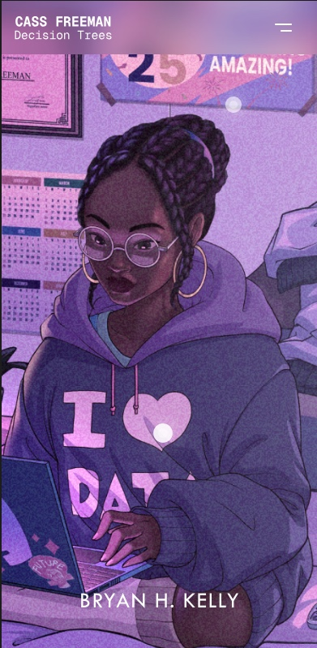

# Refactored Framer Code Component

This repository contains a refactored Framer code component that provides a draggable background with interactive hotspots (dots).

## Architecture

The code has been refactored into a modular architecture with three main components:

1. **DraggableBackground** - The main Framer code component that renders the draggable background and manages the overall state.
2. **Dot** - A plain React component that renders each interactive dot with hover/tap tooltips and link functionality.
3. **dotConfigs** - A configuration file that defines the positions and properties of all dots.

## File Structure

```
src/
├── components/
│   ├── DraggableBackground.tsx  # Main Framer component
│   ├── Dot.tsx                  # Individual dot component
│   └── dotConfigs.ts            # Configuration for all dots
└── index.tsx                    # Main export file
```

## How to Use

1. Import the DraggableBackground component in your Framer project.
2. Add it to your canvas.
3. Configure the background image and dot properties through the Framer UI.

## How to Add or Modify Dots

To add a new dot or modify an existing one:

1. Edit the `dotConfigs.ts` file to add or modify a dot configuration:
   ```typescript
   {
     id: "newdot",             // Unique identifier
     number: 14,               // Unique number (for hover state)
     dotX: 1000,               // X coordinate on the 2172x918 background
     dotY: 500,                // Y coordinate on the 2172x918 background
     linkProp: "linkNewDot",   // Property name for the link URL
     defaultLink: "#",         // Default URL
     textProp: "textNewDot",   // Property name for the hover text
     defaultText: "New Dot",   // Default text
     visibleProp: "visibleNewDot", // Property name for visibility toggle
     defaultVisible: true,     // Whether the dot is visible by default
     newWindowProp: "newWindowNewDot", // Property name for new window toggle
     defaultNewWindow: false,  // Whether to open links in new window by default
   }
   ```

2. All property controls in `DraggableBackground.tsx` are automatically generated based on the configurations in `dotConfigs.ts`, so no additional code changes are needed after adding a new dot.

3. To modify an existing dot, you can directly edit its properties in the `dotConfigs.ts` file:
   - Change `defaultLink` to update the URL
   - Change `defaultText` to update the tooltip text
   - Set `defaultVisible` to `false` to hide a dot
   - Set `defaultNewWindow` to `true` to make links open in a new window

## Features

- **Responsive Design**: Adapts to different screen sizes and orientations
- **Interactive Hotspots**: Dots with hover/tap tooltips and link functionality
- **Draggable Background**: Horizontal dragging with constraints
- **Modular Architecture**: Easy to maintain and extend
- **TypeScript Support**: Type definitions for better development experience

## Implementation Details

- The background image is draggable with horizontal constraints based on the image and viewport dimensions.
- Dots are positioned absolutely on the background and scale/position correctly as the background is dragged.
- Tooltips appear on hover (desktop) or first tap (mobile), and links are followed on click (desktop) or second tap (mobile).
- All functionality from the original implementation is preserved while improving code organization and maintainability.

## Screenshots



